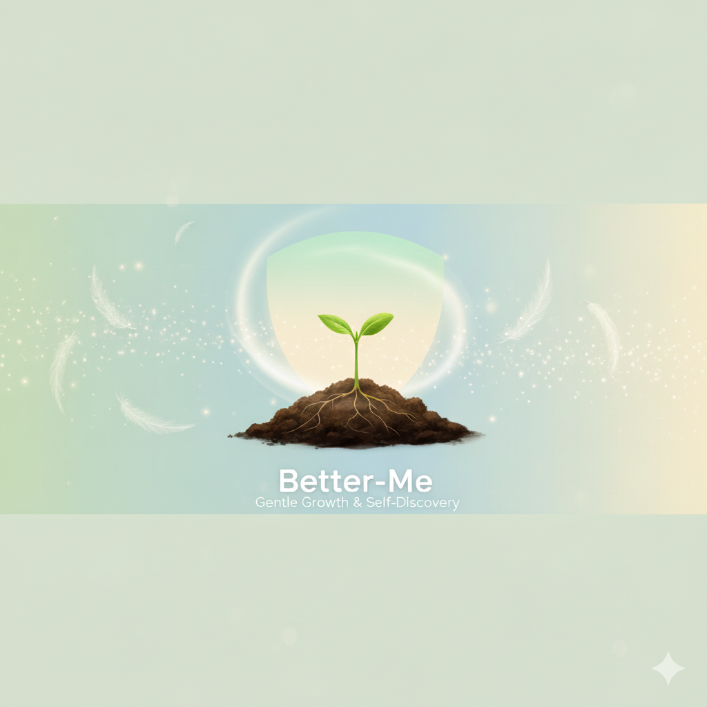

<div align="center">
  
  
  <h1>Better-Me 🌱</h1>
  <p><em>Your Gentle Companion on the Journey of Self-Discovery</em></p>
  
  [](https://www.microsoft.com/en-us/windows)
  [](https://www.electronjs.org/)
  [](https://reactjs.org/)
  [](https://www.typescriptlang.org/)
  [](LICENSE)
  [](CONTRIBUTING.md)
</div>

---

> *"The best project you'll ever work on is yourself."*  
> Better-Me is more than an app—it's a gentle, understanding companion that believes in your potential and celebrates every step forward, no matter how small.

---

## ✨ What Makes Better-Me Special?

In a world that often feels overwhelming, Better-Me offers a sanctuary of growth. We understand that self-improvement isn't about perfection—it's about progress, compassion, and the beautiful journey of becoming who you're meant to be.

### 🌟 Our Philosophy

- **Gentle Growth**: Every habit, goal, and moment of reflection is met with kindness and encouragement
- **Your Pace, Your Way**: Adapts to different needs, preferences, and learning styles
- **Celebration of Progress**: Every step forward deserves recognition, no matter how small
- **Privacy & Safety**: Your journey stays on your device, creating a safe space for authentic growth

---

## 🎯 Core Features

### 🌱 **Gentle Habit Formation**
- **Smart Suggestions**: AI-powered habit recommendations that feel natural, not overwhelming
- **Flexible Scheduling**: Daily, weekly, or custom patterns that work with your life
- **Streak Celebration**: Beautiful visual progress that motivates without pressure
- **Habit Stacking**: Connect new habits to existing ones for easier formation

### 🎯 **Meaningful Goal Setting**
- **SMART Goals Made Simple**: Break down big dreams into achievable steps
- **Category Support**: Health, career, relationships, learning, creativity, and more
- **Milestone Magic**: Celebrate progress along the way, not just at the end
- **Goal Templates**: Gentle guidance for common aspirations

### 📊 **Insightful Analytics**
- **Beautiful Visualizations**: See your progress in ways that inspire, not intimidate
- **Pattern Recognition**: Discover what works best for you
- **Trend Analysis**: Understand your rhythms and optimize accordingly
- **Export Options**: Your data, your choice

### 🎮 **Thoughtful Gamification**
- **Neurotype-Inclusive**: Designed for ADHD, Autism, and all brain types
- **Intrinsic Motivation**: Rewards that feel meaningful, not manipulative
- **Adaptive Difficulty**: Challenges that grow with you
- **Achievement Celebration**: Recognition that builds confidence

### 📖 **Reflective Journaling**
- **Guided Prompts**: Thoughtful questions that spark self-discovery
- **Mood Tracking**: Understanding the connection between feelings and progress
- **Gratitude Practice**: Cultivating appreciation for life's gifts
- **Memory Keeping**: Photos and moments that matter

### 🔔 **Caring Notifications**
- **Smart Timing**: Reminders that respect your schedule and energy
- **Motivational Messages**: Encouragement when you need it most
- **Gentle Nudges**: Supportive prompts, never pressure
- **Quiet Hours**: Respect for your rest and focus time

---

## 🧠 Inclusive Design

Better-Me is designed with accessibility and inclusivity at its core:

- **Universal Design**: Accessible to everyone, regardless of ability or learning style
- **Neurodiversity Support**: Thoughtfully designed for different ways of thinking and processing
- **Customizable Experience**: Adapt the interface to work best for you
- **Gentle Learning Curve**: No overwhelming features or complex interfaces
- **Emotional Intelligence**: Understanding and support for your unique journey

---

## 🚀 Getting Started

### Prerequisites
- Windows 11 (64-bit) or Windows 10 (version 1903+)
- 4GB RAM (8GB recommended for optimal experience)
- 500MB free disk space
- A heart ready for growth 💚

### Quick Start
1. **Download**: Get the latest release from our [GitHub Releases](https://github.com/AfyKirby1/Better-Me/releases)
2. **Install**: Run the installer or use the portable version
3. **Launch**: Open Better-Me and explore the gentle interface
4. **Begin**: Start with one small habit or goal that matters to you

### Your First Steps
- **Explore**: Take time to familiarize yourself with the interface
- **Start Small**: Choose one habit or goal to begin with
- **Be Gentle**: Remember, progress over perfection
- **Celebrate**: Notice and appreciate every small win

---

## 🎨 A Beautiful Experience

### Thoughtful Design
- **Soft Colors**: Gentle palettes that soothe and inspire
- **Clean Interface**: Uncluttered spaces that promote focus
- **Smooth Animations**: Delightful micro-interactions that bring joy
- **Accessible Typography**: Easy to read, easy to love

### Customizable Themes
- **Light Mode**: Clean and bright for daytime use
- **Dark Mode**: Gentle on the eyes for evening reflection
- **High Contrast**: Enhanced visibility for better accessibility
- **Custom Colors**: Make it truly yours

---

## 🔒 Privacy & Trust

### Your Data, Your Control
- **Local-First**: Everything stays on your device
- **No Cloud Required**: Full functionality offline
- **Encrypted Storage**: Your personal journey is protected
- **Export Options**: Take your data anywhere, anytime

### Transparent & Ethical
- **Open Source**: Code you can trust and contribute to
- **No Tracking**: We don't monitor or analyze your personal data
- **Community Driven**: Built by people who care about your growth
- **Regular Updates**: Continuous improvement with your feedback

---

## 🤝 Community & Support

### Join Our Journey
- **GitHub Discussions**: Share experiences and get support
- **Feature Requests**: Help shape the future of Better-Me
- **Bug Reports**: Help us improve your experience
- **Contributions**: Code, design, or documentation—every contribution matters

### Getting Help
- **Documentation**: Comprehensive guides in our [docs](docs/) folder
- **FAQ**: Common questions and gentle answers
- **Community Support**: Kind, helpful people who understand your journey
- **Professional Support**: When you need extra help

---

## 🛠️ For Developers

### Tech Stack
- **Frontend**: React 18 + TypeScript for type safety and modern development
- **Desktop**: Electron for beautiful native desktop experience
- **Styling**: Tailwind CSS for rapid, consistent, beautiful styling
- **Database**: SQLite for reliable, local data storage
- **State**: Redux Toolkit for predictable state management

### Development Setup
```bash
# Clone the repository
git clone https://github.com/AfyKirby1/Better-Me.git
cd Better-Me

# Install dependencies
npm install

# Start development server
npm run dev

# Build for production
npm run build

# Package for Windows
npm run dist
```

### Contributing
We welcome contributions from developers who share our vision of gentle, inclusive self-improvement. Please see our [Contributing Guide](CONTRIBUTING.md) for details.

---

## 📚 Documentation

- [User Guide](docs/USER_GUIDE.md) - Complete user manual and getting started guide
- [Architecture Guide](docs/ARCHITECTURE.md) - Technical architecture and design decisions
- [Contributing Guide](CONTRIBUTING.md) - How to contribute to the project
- [Security Policy](SECURITY.md) - Security practices and vulnerability reporting
- [Code of Conduct](CODE_OF_CONDUCT.md) - Community guidelines and expectations
- [Changelog](CHANGELOG.md) - Version history and release notes
- [Design Document](docs/DESIGN_DOCUMENT.md) - Comprehensive technical design
- [Requirements](docs/REQUIREMENTS.md) - Detailed feature specifications
- [Gamification Psychology](docs/GAMIFIED.md) - Advanced psychological framework

---

## 🌟 Our Vision

Better-Me isn't just an app—it's a movement toward kinder, more compassionate self-improvement. We believe that:

- **Growth is a journey, not a destination**
- **Every person deserves support and understanding**
- **Technology should serve human flourishing**
- **Privacy and autonomy are fundamental rights**
- **Community and connection make us stronger**

---

## 📄 License

This project is licensed under the MIT License - see the [LICENSE](LICENSE) file for details.

---

## 🙏 Acknowledgments

- **To every person** who has ever struggled with self-improvement
- **To the neurodivergent community** for teaching us about different ways of being
- **To the researchers** who have advanced our understanding of motivation and behavior
- **To the open-source community** for making this project possible
- **To you** for believing in the power of gentle growth

---

## 💚 A Message from the Team

Better-Me was created from a simple belief: that self-improvement doesn't have to be harsh or overwhelming. It can be gentle, supportive, and even joyful.

Whether you're here to build better habits, achieve meaningful goals, or simply understand yourself better, we're here to support you with compassion, understanding, and celebration of every step forward.

You are worthy of growth. You are worthy of support. You are worthy of becoming exactly who you're meant to be.

Welcome to Better-Me. Welcome to your journey.

With love and encouragement,  
The Better-Me Team 💚

---

**Better-Me** - *Because the best project you'll ever work on is yourself.* 🌱

*Made with ❤️ for Windows 11 users who believe in gentle, sustainable growth.*